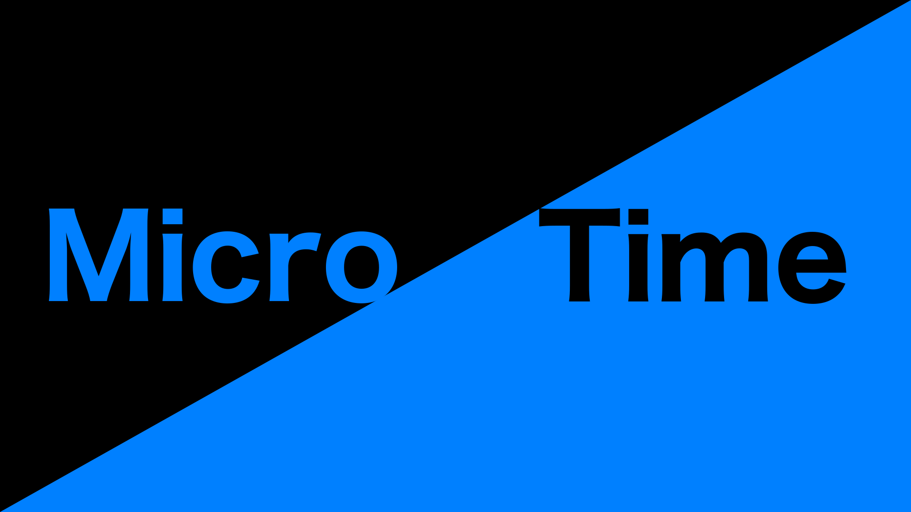

# MicroTime - [Demo](https://kamu.jp/microtime/)

## How
This is a new way of expressing time that can represent very long periods of time.

It's very simple:
1. Measure the number of milliseconds since January 1, 2000 (UTC)
2. Convert to binary

## About LICENSE
MicroTime is licensed under the MIT License, but no copyright notice is required if you are only using MicroTime to display time.

## Logo
Anyone can use the MicroTime Logo for free.

You may use the image data in `./assets/` directory without attribution, as long as you follow these guidelines:
- Do not change the colors or make any modifications that significantly reduce visibility.
- Do not change the text in the MicroTime logo to a different font or characters.

## Versions
- 48: Up to about 2925 years
- 64: Up to about 586554 years
- 96: Up to about 2.5 sextillion years
- 128: Up to about 10 nonillion years

### MicroTime 48
- MicroTime 48 is the first MicroTime notation.
- It represents MicroTime with 48 digits.
- It can be used up to about the year 2925.

### MicroTime 64
- MicroTime 64 is the second MicroTime notation.
- It represents MicroTime with 64 digits.
- It can be used up to about the year 586554.

### MicroTime XXX
At the time of creating MicroTime, 48 bits was more than enough, and we believe that 64 bits is very reliable.

However, the "UNIX epoch", which was the standard at the time, was originally 32 bits, and was a notation method that would soon run out of space.

If you run out of digits in MicroTime, please see below:
- Feel free to also use MicroTime 96 or MicroTime 128.
- However, make sure that the number part is the "number of digits in binary form".
